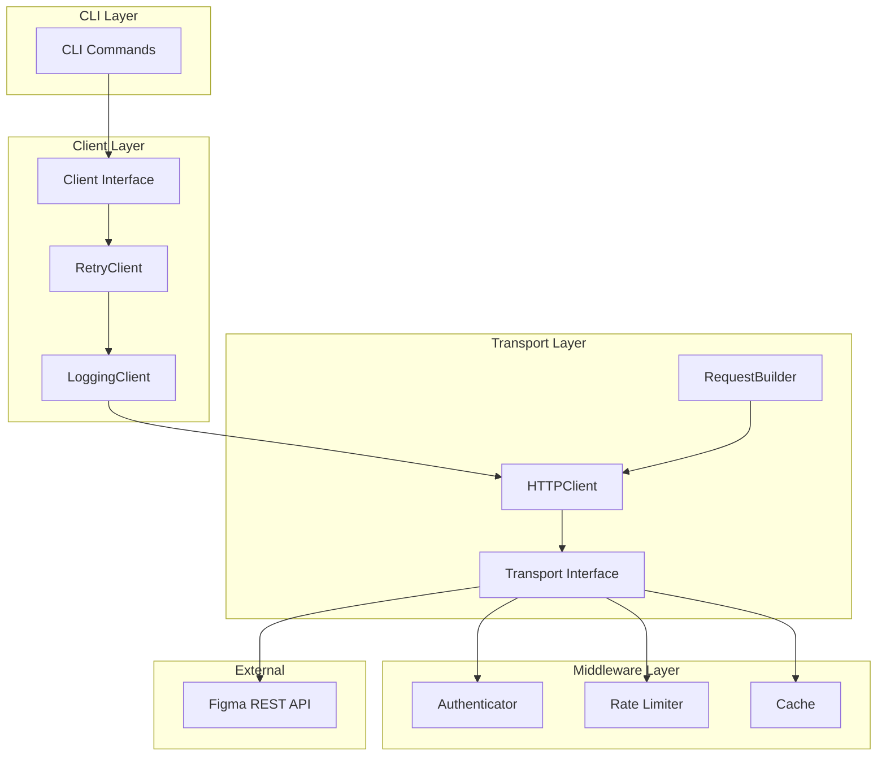

# Figma API Client Architecture

## Overview
The Figma API client is designed with separation of concerns, testability, and maintainability as primary goals. The architecture follows a layered approach with clear interfaces between components.

## Architecture Diagram



## Component Descriptions

### Client Interface (`internal/api/client.go`)
Defines the complete contract for interacting with the Figma API. All client implementations must satisfy this interface. The interface includes methods for:
- File operations (get, metadata, versions)
- Node operations (get single, get multiple)
- Image operations (export)
- Comment operations (list, create, delete, reactions)
- Style operations (team, file, specific)
- Component operations (team, file, specific)
- Project & Team operations
- User operations (current user)
- Variable operations (Enterprise)
- Dev resources
- Webhooks (v2)

### Retry Client (`internal/api/retry_client.go`)
Wraps any `Client` implementation and adds automatic retry logic for transient errors (rate limits, server errors). Uses configurable retry policies with exponential backoff and jitter.

### Logging Client (`internal/api/client_logging.go`)
Wraps any `Client` implementation and adds structured logging of requests, responses, and performance metrics. Integrates with the project's logging system.

### HTTP Client (`internal/api/transport/http_client.go`)
Concrete implementation of `Client` interface that translates API calls to HTTP requests. Uses a configurable `Transport` for HTTP communication and `RequestBuilder` for constructing requests.

### Transport Layer (`internal/api/transport/`)
Abstracts HTTP communication details:
- **Transport Interface**: Executes HTTP requests, allowing custom implementations (mock, test, etc.)
- **RequestBuilder**: Constructs properly formatted requests with correct headers and serialization
- **RoundTripper**: Chainable middleware for authentication, rate limiting, caching

### Authentication (`internal/api/auth/`)
Handles authentication credentials:
- **TokenAuthenticator**: Adds `Authorization: Bearer <token>` header
- Supports Personal Access Tokens (PAT) as primary auth method
- Extensible for OAuth2 in the future

### Rate Limiting (`internal/api/ratelimit/`)
Manages API rate limits:
- **Limiter Interface**: Blocks requests when limits are exceeded
- **TokenBucketLimiter**: Implements token bucket algorithm
- **HeaderParser**: Extracts rate limit information from response headers
- Respects `Retry-After` and `X-RateLimit-*` headers

### Caching (`internal/api/cache/`) - Optional
Provides response caching to reduce API calls:
- **Cache Interface**: Simple get/set/delete operations
- **MemoryCache**: In-memory cache with TTL support
- **FileCache**: Persistent cache for offline usage

## Dependency Injection

All components are designed with dependency injection in mind:

```go
func NewDefaultClient(cfg *config.Config, logger logging.Logger) (api.Client, error) {
    // Create authenticator
    auth := auth.NewTokenAuthenticator(cfg.Token)
    
    // Create rate limiter
    limiter := ratelimit.NewTokenBucketLimiter()
    
    // Create transport with middleware
    transport := transport.NewRoundTripper(
        auth,
        limiter,
        cfg.API.Timeout,
    )
    
    // Create HTTP client
    httpClient := &http.Client{Transport: transport}
    
    // Create request builder
    builder := transport.NewRequestBuilder(cfg.API.BaseURL)
    
    // Create concrete HTTP client
    client := transport.NewHTTPClient(httpClient, builder)
    
    // Wrap with logging
    client = api.NewLoggingClient(client, logger)
    
    // Wrap with retry
    client = api.NewRetryClient(client)
    
    return client, nil
}
```

## Integration Points

### Error Handling
- Uses existing `APIError`, `RateLimitError`, `AuthError`, `ParseError` types
- `ErrorFromResponse` converts HTTP responses to appropriate error types
- All client methods return typed errors for precise handling

### Retry Logic
- Leverages existing `WithRetry` function and `RetryConfig`
- Rate limit errors automatically trigger retry with `Retry-After` header
- Configurable via `config.APISettings`

### Logging
- Uses `internal/logging` system
- Structured logging with request/response details
- Performance metrics (duration)

### Configuration
- Uses `internal/config` for API base URL, timeout, retries, debug flags
- Authentication token from `cfg.Token`
- Rate limiting settings from configuration

## Testing Strategy

1. **Unit Tests**: Mock dependencies using interfaces
2. **Integration Tests**: Test against real API with test token
3. **Contract Tests**: Ensure implementations satisfy `Client` interface
4. **Performance Tests**: Verify rate limiting and caching behavior

## Future Enhancements

1. **OAuth2 Support**: Add token refresh flow
2. **WebSocket Support**: Real-time updates for file changes
3. **Batching**: Combine multiple API calls into single requests
4. **Pagination**: Automatic handling of paginated responses
5. **Metrics Collection**: Export performance metrics for monitoring
6. **Plugin System**: Allow custom middleware injection